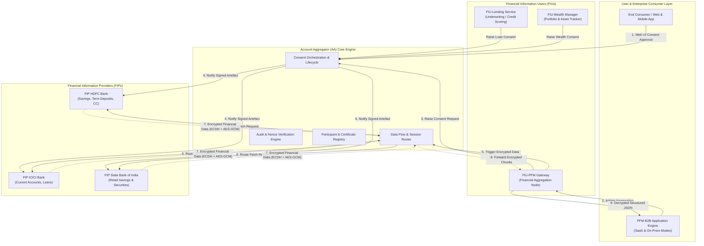
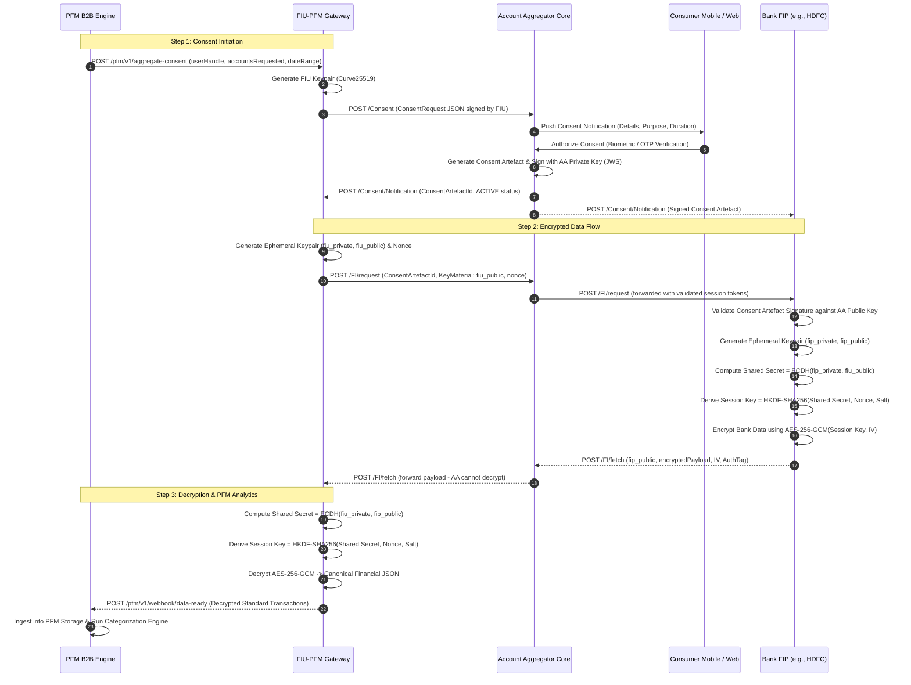

# Architecture Specification: Open-AA-Sandbox & PFM Ecosystem Simulator

> **Project Name:** `open-aa-sandbox`  
> **Repository Target:** Standalone Open-Source Monorepo / Multi-Module Reactive Engine  
> **Author & Architect:** Aravind Suresh (Senior Technical Lead Engineer)  
> **Specification Standard:** RBI Master Directions & ReBIT Account Aggregator Specifications (v1.1+)  
> **Target Concurrency:** 10,000+ RPS sustained, 1 Crore+ (10M+) synthetic daily transaction processing  

---

## 1. Executive Summary & Vision

The **`open-aa-sandbox`** is a high-performance, reactive, open-source ecosystem simulator replicating India's **Account Aggregator (AA)** financial data sharing network. 

In production fintech environments, developers and institutions face substantial integration bottlenecks:
1. Live bank sandbox environments (FIPs) are frequently unstable, rate-limited, or unavailable.
2. ReBIT-compliant end-to-end cryptography (Curve25519 ephemeral key exchange, AES-GCM payload encryption, digital signatures) is notoriously difficult to test locally.
3. Multi-entity interactions involving multiple Financial Information Providers (FIPs), multiple Financial Information Users (FIUs), and consumer platforms (such as enterprise Personal Finance Management - PFM) lack a unified, reproducible testing framework.

**`open-aa-sandbox`** solves this by providing a zero-external-dependency, containerized, reactive ecosystem running on **Java 21, Spring Boot 3.3+, Spring WebFlux (Project Reactor), Netty, Redis, and Apache Kafka**.

---

## 2. System Topology & Architectural Ecosystem



---

## 3. Core Ecosystem Participants

### 3.1. Account Aggregator (AA) Core (`aa-core`)
* **Role:** Intermediary blind-pipe consent manager.
* **Key Responsibilities:**
  * User identity handle management (`user@aa`).
  * Consent management lifecycle (`PENDING` -> `ACTIVE` -> `REVOKED` -> `EXPIRED` -> `PAUSED`).
  * Signing cryptographic **Consent Artefacts** with AA private key.
  * Validation of digital signatures, timestamps, and request nonces.
  * Zero-knowledge routing: **AA cannot inspect financial data**; data passing through AA is encrypted under the recipient FIU's ephemeral key.

### 3.2. Multiple Financial Information Providers (`fip-simulator`)
Simulates Tier-1 Indian banking servers with realistic banking datasets and latency simulation:
* **`FIP-HDFC`**:
  * Accounts: Savings accounts, Fixed Deposits, Credit Card statements.
  * Latency Profile: Fast sub-100ms response.
* **`FIP-ICICI`**:
  * Accounts: Current accounts, Overdraft accounts, Business lending records.
  * Latency Profile: Jittered 150ms–300ms response with periodic rate-limit simulations.
* **`FIP-SBI`**:
  * Accounts: High-volume retail savings accounts, Government security holding certificates.
  * Latency Profile: Batch-mode / chunked data transfer simulation.
* **Common FIP Capabilities:**
  * Account Discovery API (matching mobile number to masked accounts).
  * Account Linking & OTP verification.
  * Consent Notification Webhook ingestion.
  * High-performance on-the-fly ECDH `x25519` key exchange + `AES-256-GCM` payload encryption.

### 3.3. Multiple Financial Information Users (`fiu-engine`)
* **`FIU-PFM-Gateway`**: Tailored for Personal Finance Management. Initiates periodic and one-off recurring consents across all linked bank accounts (HDFC, ICICI, SBI).
* **`FIU-Lending`**: Simulates automated underwriting for digital loans. Focuses on 6-month historical bank statements, salary credits, and bounce/cheque penalty detection.
* **`FIU-Wealth`**: Simulates net-worth aggregation engines focusing on quarterly recurring consent, deposit balances, interest yields, and investment inflows.

### 3.4. PFM (Personal Finance Management) Platform (`pfm-b2b-app`)
* **Integration with FIU:** Consumes sanitized, decrypted data from `FIU-PFM-Gateway`.
* **Dual-Target Deployment Support:**
  * **SaaS Mode:** Multi-tenant shared DB with dynamic tenant context routing (`TenantContextHolder`), AWS S3 / MinIO cold-storage statement archives.
  * **On-Premises Mode:** Isolated single-tenant air-gapped configuration, local filesystem / PostgreSQL storage, zero public cloud dependency.
* **Core PFM Engines:**
  * **Unified Account Normalization:** Standardizes divergent transaction formats from HDFC, ICICI, and SBI into canonical ReBIT / ISO-20022 JSON models.
  * **Transaction Categorization Engine:** Rule-based and semantic categorization (Groceries, Utilities, Investments, Discretionary Spend, EMI, Salary).
  * **Financial Health & Cash-Flow Analyzer:** Daily balance velocity, recurring expense detection, savings rate metrics, and liquidity risk alerts.

---

## 4. Cryptographic Flow & ReBIT Compliance



### 4.1. Cryptographic Primitives Table

| Component | Standard Specification | Implementation in `open-aa-sandbox` |
| :--- | :--- | :--- |
| **Key Agreement** | Diffie-Hellman on Curve25519 (`x25519`) | BouncyCastle / Java 21 Native `X25519` |
| **Key Derivation** | HKDF-SHA256 (RFC 5869) | `HKDFBytesGenerator` with session nonces |
| **Data Encryption** | Authenticated `AES-256-GCM` | 256-bit key, 96-bit random IV, 128-bit authentication tag |
| **Artefact Signing** | RSA-SHA256 / Ed25519 Digital Signatures | Nimbus JOSE + JWT (JSON Web Signature) |
| **Timestamp Validation** | UTC ISO-8601 with 5-minute replay window | Distributed Redis replay cache checking nonces |

---

## 5. Module Structure & Monorepo Layout

```
open-aa-sandbox/
├── pom.xml                                   # Root Maven Multi-Module Reactor
├── README.md                                 # Quickstart, architecture guide & benchmarks
├── docker-compose.yml                        # 1-Click Cluster (Redis, Kafka, Netty Services)
│
├── aa-crypto-commons/                        # Shared cryptographic engine
│   ├── src/main/java/com/openaa/crypto/
│   │   ├── ecdh/Curve25519KeyAgreement.java
│   │   ├── cipher/AesGcmCipherService.java
│   │   ├── hkdf/HkdfKeyDerivation.java
│   │   └── signature/JwsSignatureVerifier.java
│
├── aa-core/                                  # Account Aggregator Core Orchestrator
│   ├── src/main/java/com/openaa/core/
│   │   ├── controller/ConsentController.java
│   │   ├── controller/DataFlowController.java
│   │   ├── service/ConsentLifecycleService.java
│   │   └── router/BlindDataRouter.java
│
├── fip-simulator/                            # Multi-Bank FIP Simulator Engine
│   ├── src/main/java/com/openaa/fip/
│   │   ├── controller/FipDiscoveryController.java
│   │   ├── controller/FipDataFetchController.java
│   │   ├── service/BankDataEncryptionService.java
│   │   └── datastore/MockBankLedgerStore.java  # Configurable datasets (HDFC, ICICI, SBI)
│
├── fiu-engine/                               # Multi-Tenant FIU Services
│   ├── src/main/java/com/openaa/fiu/
│   │   ├── controller/FiuConsentGateway.java
│   │   ├── controller/FiuDataFetchGateway.java
│   │   ├── service/FiuDecryptionService.java
│   │   └── dispatcher/PfmEventDispatcher.java
│
├── pfm-b2b-app/                              # Enterprise PFM B2B Engine
│   ├── src/main/java/com/openaa/pfm/
│   │   ├── controller/PfmAggregationController.java
│   │   ├── tenant/TenantContextHolder.java   # SaaS vs On-Premises dynamic router
│   │   ├── analytics/CategorizationService.java
│   │   ├── analytics/CashFlowForecastEngine.java
│   │   └── pipeline/ReactiveIngestionPipeline.java
│
└── simulation-runner/                        # Benchmark & Load Test Harness (Gatling / k6)
    ├── src/test/scala/com/openaa/benchmarks/
    │   ├── MultiBankConsentSimulation.scala
    │   └── HighThroughputDataFetch10MRps.scala
```

---

## 6. End-to-End API Specifications

### 6.1. PFM to FIU Integration Contract

#### Request: Initiate Account Aggregation from PFM
```http
POST /pfm/v1/aggregate
Host: fiu-pfm-gateway:8082
Content-Type: application/json
X-Tenant-ID: tenant-bank-hdfc-saas

{
  "customerId": "CUST_98765",
  "customerHandle": "aravind@aa",
  "fips": ["FIP-HDFC", "FIP-ICICI", "FIP-SBI"],
  "consentPurpose": "PFM_WEALTH_INSIGHTS",
  "dateRange": {
    "from": "2025-10-01T00:00:00Z",
    "to": "2026-03-31T23:59:59Z"
  },
  "recurring": true,
  "frequency": "MONTHLY"
}
```

#### Response: Consent Initiated
```http
HTTP/1.1 202 Accepted
Content-Type: application/json

{
  "consentTxnId": "txn_88e018fa-f67c-47bc-967b-1cb8f4b0059e",
  "consentStatus": "PENDING_APPROVAL",
  "approvalRedirectUrl": "http://localhost:8080/consent/approve?txn=txn_88e018fa-f67c-47bc-967b-1cb8f4b0059e",
  "expiresAt": "2026-09-30T10:00:00Z"
}
```

---

### 6.2. ReBIT Encrypted Financial Payload Sample (Passing through AA)

When `FIP-HDFC` responds to the data request, AA receives **only** this encrypted payload:

```json
{
  "ver": "1.1.2",
  "timestamp": "2026-09-29T09:45:00.123Z",
  "txnid": "txn_88e018fa-f67c-47bc-967b-1cb8f4b0059e",
  "KeyMaterial": {
    "cryptoAlg": "ECDH",
    "curve": "Curve25519",
    "params": "cipher=AES/GCM/NoPadding;keylen=256",
    "DHPublicKey": {
      "Expiry": "2026-09-29T10:45:00.000Z",
      "Parameters": "",
      "KeyValue": "4a71d604b1e5a595cb6a2a0a2df362241b7fcf5298f2f255f0b58e2bf1229f34"
    },
    "Nonce": "e81d77a9446f481c81062b1a52b82142"
  },
  "fipId": "FIP-HDFC",
  "encryptedFI": "6sH1y7XWfE8zX...[Base64 Encrypted Ciphertext]...kL8u"
}
```

---

### 6.3. Decrypted Structured Financial Data (Delivered to PFM)

Once `FIU-PFM-Gateway` computes the shared secret and decrypts the ciphertext, PFM ingests the canonical normalized JSON:

```json
{
  "fipId": "FIP-HDFC",
  "account": {
    "type": "SAVINGS",
    "maskedAccNumber": "XXXX-XXXX-4819",
    "currency": "INR",
    "currentBalance": 452800.50,
    "transactions": [
      {
        "txnId": "HDFC_TXN_0019283",
        "type": "CREDIT",
        "amount": 285000.00,
        "narration": "SALARY CREDIT - PERFIOS SOFTWARE SOLUTIONS",
        "timestamp": "2026-03-31T06:30:00Z",
        "reference": "UPI/98127391823/SALARY",
        "pfmCategory": "SALARY_INCOME",
        "confidenceScore": 0.99
      },
      {
        "txnId": "HDFC_TXN_0019284",
        "type": "DEBIT",
        "amount": 14500.00,
        "narration": "TRANSFER TO HDFC MUTUAL FUND SIP",
        "timestamp": "2026-04-02T10:15:00Z",
        "reference": "NEFT/MF/99218273",
        "pfmCategory": "INVESTMENTS_SIP",
        "confidenceScore": 0.98
      }
    ]
  }
}
```

---

## 7. Implementation Roadmap & MVP Phases

### Phase 1: Core Cryptography & Data Contracts (`aa-crypto-commons`)
- [ ] Implement `Curve25519KeyAgreement` using Java 21 native `KeyPairGenerator.getInstance("X25519")`.
- [ ] Implement `HkdfKeyDerivation` (RFC 5869) and `AesGcmCipherService` with authenticated tags.
- [ ] Implement unit tests validating known test vectors against ReBIT reference implementations.

### Phase 2: Reactive AA Core & Registry (`aa-core`)
- [ ] Build Spring WebFlux Netty router for non-blocking HTTP endpoints.
- [ ] Implement Redis-backed Consent Registry with state machine validation (`PENDING`, `ACTIVE`, `REVOKED`).
- [ ] Add JWS signing engine for verifiable Consent Artefacts.

### Phase 3: Multi-Bank FIP Simulator (`fip-simulator`)
- [ ] Implement bank profile loaders (`HDFC.json`, `ICICI.json`, `SBI.json`).
- [ ] Build Account Discovery and OTP mock linking flows.
- [ ] Implement high-throughput reactive data encryption pipeline streaming encrypted JSON chunks.

### Phase 4: Multi-FIU & PFM Gateway (`fiu-engine` & `pfm-b2b-app`)
- [ ] Implement `FIU-PFM-Gateway`, `FIU-Lending`, and `FIU-Wealth`.
- [ ] Implement automated session key negotiation and payload decryption.
- [ ] Build PFM B2B transaction normalization and rule-based categorization engine.
- [ ] Implement multi-tenant SaaS vs On-Premises configuration toggles.

### Phase 5: Containerization, Testing & Documentation
- [ ] Create `docker-compose.yml` orchestrating all nodes on a shared bridge network.
- [ ] Write Gatling / k6 load simulation script demonstrating 10,000+ RPS sustained throughput.
- [ ] Polish developer documentation and interactive Swagger / OpenAPI test UI.

---

## 8. Architectural Summary

| Parameter | Specification |
| :--- | :--- |
| **Java Platform** | Java 21 (LTS) with Virtual Threads enabled (`-Djdk.virtualThreadScheduler=...`) |
| **Web Framework** | Spring Boot 3.3.x + Spring WebFlux (Project Reactor / Netty) |
| **Message Broker** | Apache Kafka 3.7+ / Reactive Kafka (Event-driven data dispatch) |
| **Distributed Cache** | Redis 7.2 (Replay protection nonces, consent state caching) |
| **Security Standards** | ReBIT AA Technical Framework v1.1.2, RFC 7748 (Curve25519), RFC 5869 (HKDF) |
| **Deployment Modes** | Docker Compose / Helm for Kubernetes (SaaS & Air-Gapped On-Prem) |
